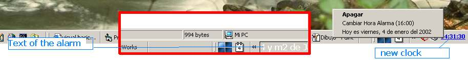



## alarm & clock in systray\.\.\.

### Description

a simple alarm clock, but it shows a message into the systray.
 
### More Info
 

             |
---                |---
**Submitted On**   |2002-01-04 14:51:32
**By**             |[MaRiØ G\. Serrano](https://github.com/Planet-Source-Code/PSCIndex/blob/master/ByAuthor/mari-g-serrano.md)
**Level**          |Intermediate
**User Rating**    |5.0 (10 globes from 2 users)
**Compatibility**  |VB 6\.0
**Category**       |[Coding Standards](https://github.com/Planet-Source-Code/PSCIndex/blob/master/ByCategory/coding-standards__1-43.md)
**World**          |[Visual Basic](https://github.com/Planet-Source-Code/PSCIndex/blob/master/ByWorld/visual-basic.md)
**Archive File**   |[alarm\_&\_cl46225142002\.zip](https://github.com/Planet-Source-Code/mari-g-serrano-alarm-clock-in-systray__1-30377/archive/master.zip)

